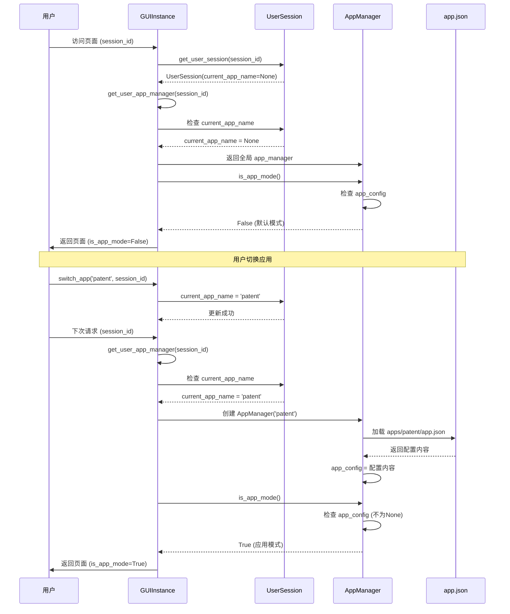
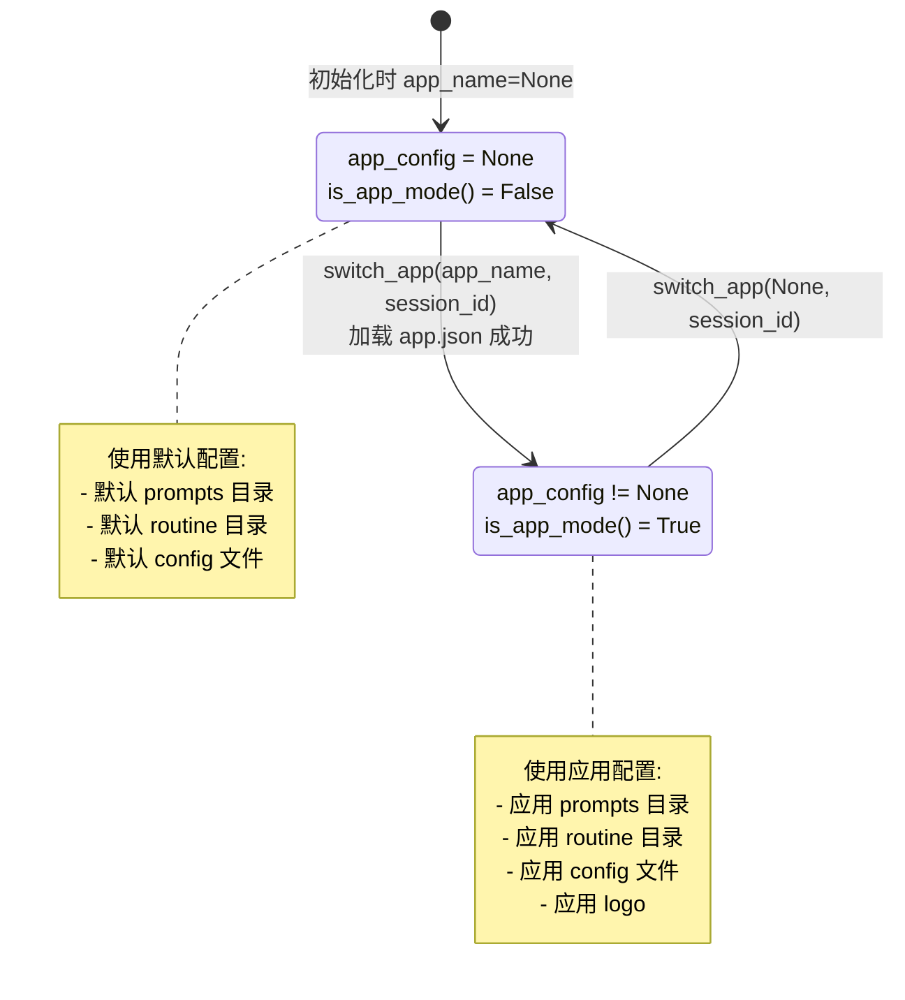
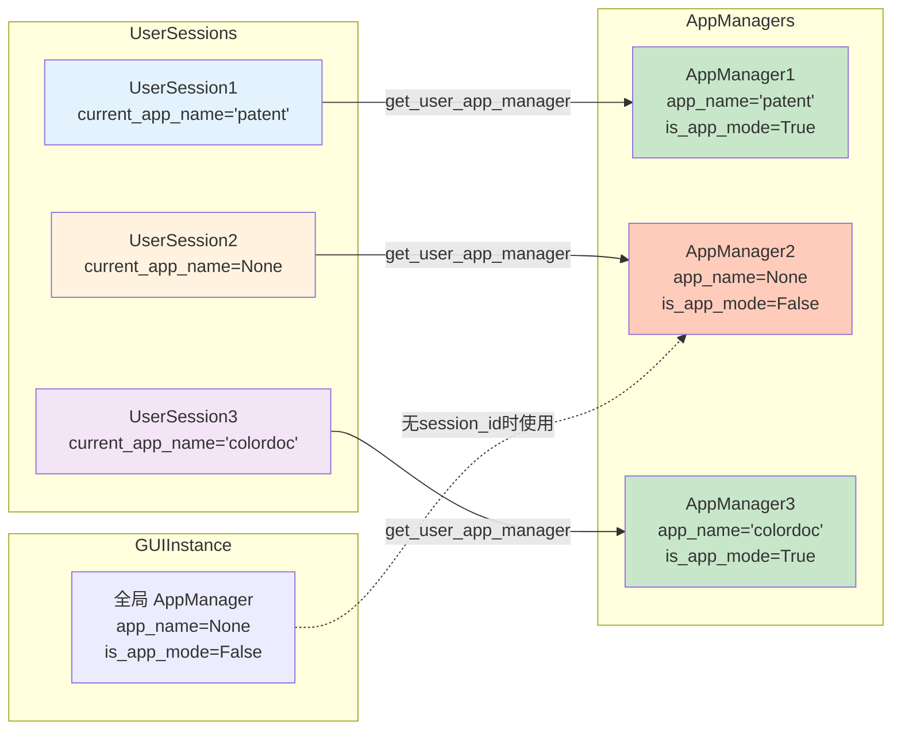

# is_app_mode() 处理流程示意图

## 完整流程图

```mermaid
graph TB
    Start([系统启动/用户请求]) --> InitGUI{GUIInstance初始化}
    
    InitGUI --> InitAppManager[创建全局AppManager<br/>app_name=initial_app_name]
    InitAppManager --> CheckInitApp{initial_app_name<br/>是否为None?}
    
    CheckInitApp -->|是None| SetDefault[app_config = None<br/>is_app_mode = False]
    CheckInitApp -->|不是None| LoadConfig1[加载app.json配置]
    
    LoadConfig1 --> ConfigExists1{配置文件<br/>是否存在?}
    ConfigExists1 -->|存在| SetConfig1[app_config = 配置内容<br/>is_app_mode = True]
    ConfigExists1 -->|不存在| SetDefault
    
    SetDefault --> CreateSession[用户创建Session]
    SetConfig1 --> CreateSession
    
    CreateSession --> InitUserSession[UserSession初始化<br/>current_app_name = None]
    
    InitUserSession --> UserRequest[用户请求到达]
    
    UserRequest --> GetSessionID{是否有<br/>session_id?}
    
    GetSessionID -->|有session_id| CheckUserApp{user_session<br/>current_app_name<br/>是否为None?}
    GetSessionID -->|无session_id| UseGlobal[使用全局AppManager<br/>gui_instance.app_manager]
    
    CheckUserApp -->|不是None| CreateUserAppManager[创建新的AppManager<br/>app_name=current_app_name]
    CheckUserApp -->|是None| UseGlobal
    
    CreateUserAppManager --> LoadUserConfig[加载app.json配置]
    LoadUserConfig --> ConfigExists2{配置文件<br/>是否存在?}
    
    ConfigExists2 -->|存在| SetConfig2[app_config = 配置内容<br/>is_app_mode = True]
    ConfigExists2 -->|不存在| SetConfigNone[app_config = None<br/>is_app_mode = False]
    
    SetConfig2 --> CallIsAppMode[调用is_app_mode方法]
    SetConfigNone --> CallIsAppMode
    UseGlobal --> CallIsAppMode
    
    CallIsAppMode --> CheckAppConfig{检查<br/>app_config<br/>是否为None?}
    
    CheckAppConfig -->|不是None| ReturnTrue[返回True<br/>应用模式]
    CheckAppConfig -->|是None| ReturnFalse[返回False<br/>默认模式]
    
    ReturnTrue --> UseAppConfig[使用应用特定配置<br/>- prompts_folder<br/>- routine_path<br/>- config_path<br/>- logo_path]
    ReturnFalse --> UseDefaultConfig[使用默认配置<br/>- 默认prompts<br/>- 默认routine<br/>- 默认config]
    
    UseAppConfig --> PassToTemplate[传递给前端模板<br/>is_app_mode=True]
    UseDefaultConfig --> PassToTemplate2[传递给前端模板<br/>is_app_mode=False]
    
    PassToTemplate --> End([处理完成])
    PassToTemplate2 --> End
    
    %% 切换应用流程
    UserRequest --> SwitchApp{用户调用<br/>switch_app?}
    SwitchApp -->|是| CheckSessionID2{是否有<br/>session_id?}
    SwitchApp -->|否| GetSessionID
    
    CheckSessionID2 -->|有session_id| UpdateUserApp[更新user_session<br/>current_app_name = app_name]
    CheckSessionID2 -->|无session_id| UpdateGlobalApp[更新全局app_manager<br/>重新创建AppManager实例]
    
    UpdateUserApp --> NextRequest[下次请求时生效]
    UpdateGlobalApp --> NextRequest
    NextRequest --> GetSessionID
    
    style Start fill:#e1f5ff
    style End fill:#c8e6c9
    style ReturnTrue fill:#fff9c4
    style ReturnFalse fill:#ffccbc
    style UseAppConfig fill:#c5e1a5
    style UseDefaultConfig fill:#ffccbc
```



## 关键节点说明

### 1. 初始化阶段

```
系统启动
  ↓
GUIInstance.__init__(app_name=initial_app_name)
  ↓
创建全局 AppManager(app_name=initial_app_name)
  ↓
如果 app_name 不为 None:
  - 尝试加载 apps/{app_name}/app.json
  - 成功 → app_config = 配置内容 → is_app_mode() = True
  - 失败 → app_config = None → is_app_mode() = False
```

### 2. 用户 Session 创建

```
用户首次访问
  ↓
get_user_session(session_id, api_key)
  ↓
创建 UserSession
  - current_app_name = None (默认值)
  ↓
下次请求时，get_user_app_manager(session_id)
  - 如果 current_app_name 为 None → 返回全局 AppManager
  - 如果 current_app_name 不为 None → 创建新的 AppManager(current_app_name)
```

### 3. is_app_mode() 调用流程

```
获取 AppManager 实例
  ↓
user_app_manager = get_user_app_manager(session_id)
  ↓
调用 is_app_mode()
  ↓
检查: app_config is not None?
  ↓
  ├─ 是 → 返回 True (应用模式)
  └─ 否 → 返回 False (默认模式)
```

### 4. 应用切换流程

```
用户调用 switch_app(app_name, session_id)
  ↓
如果有 session_id:
  - 设置 user_session.current_app_name = app_name
  - 下次 get_user_app_manager() 时生效
  ↓
如果没有 session_id:
  - 重新创建全局 app_manager = AppManager(app_name)
  - 立即生效
```

## 数据流图



## 状态转换图



## 多用户隔离示意图



## 关键代码路径

### 路径1: 默认模式（无应用）

```
1. GUIInstance.__init__(app_name=None)
   → AppManager(app_name=None)
   → app_config = None
   → is_app_mode() = False

2. UserSession.__init__()
   → current_app_name = None

3. get_user_app_manager(session_id)
   → current_app_name = None
   → 返回全局 app_manager
   → is_app_mode() = False
```

### 路径2: 应用模式（有应用）

```
1. GUIInstance.__init__(app_name='patent')
   → AppManager(app_name='patent')
   → 加载 apps/patent/app.json
   → app_config = {...}
   → is_app_mode() = True

2. switch_app('patent', session_id)
   → user_session.current_app_name = 'patent'

3. get_user_app_manager(session_id)
   → current_app_name = 'patent'
   → 创建 AppManager('patent')
   → 加载 apps/patent/app.json
   → app_config = {...}
   → is_app_mode() = True
```

### 路径3: 切换应用

```
1. 当前状态: current_app_name = 'patent'
   → is_app_mode() = True

2. switch_app('colordoc', session_id)
   → current_app_name = 'colordoc'

3. 下次请求: get_user_app_manager(session_id)
   → 创建 AppManager('colordoc')
   → 加载 apps/colordoc/app.json
   → app_config = {...}
   → is_app_mode() = True
```

### 路径4: 重置为默认模式

```
1. 当前状态: current_app_name = 'patent'
   → is_app_mode() = True

2. switch_app(None, session_id)
   → current_app_name = None

3. 下次请求: get_user_app_manager(session_id)
   → current_app_name = None
   → 返回全局 app_manager
   → is_app_mode() = False
```
